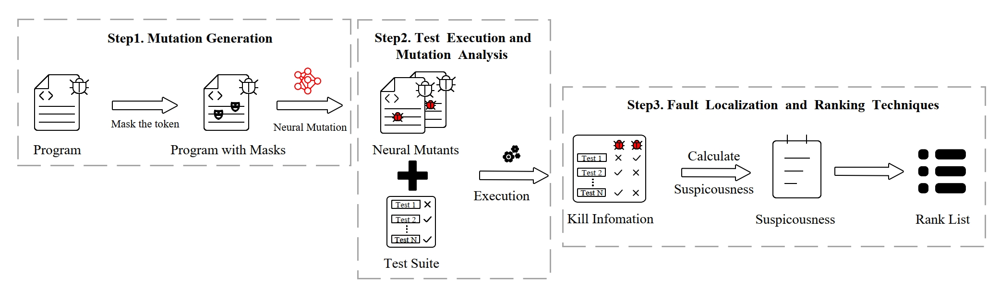

# Neural-MBFL
This project is the experimental code for Neural-Mutation Based Fault Localization.
Neural-MBFL is a novel fault localization approach based on neural mutation. 

We utilize mutation techniques based on CodePTM at the token level, using μbert for mutant generation, replacing traditional mutation techniques in MBFL.
Below is an experimental framework diagram of our project:

## Requirements
- `python 3.7.0`
- [*CodeBERT*](https://github.com/microsoft/CodeBERT) dependencies:
  - `pip install torch`
  - `pip install transformers`

## Directory Structure

### Main Directory 
- `calculation.py`: Script reated to metric calculations.
- `failVersion.json`: JSON file containing information about failed versions.
- `main.py`: Main script for the Mutation Tool project.

### `neural-mutation` Directory:  Scripts related to μbert
- `mbert`: mbert mutation testing tool 
- `mBert4d4j-test.py`: get neural mutations.
- `getNullMutantLine.py`: Records lines without mutants.
- `getTargetLineMutant.py.py`: get targetline neural mutations

### `traditional-mutation` Directory:  Scripts related to tradition mutation
-`generatemutants.py`:get tradition mutations

### `execute` Directory: Scripts execute testing to get kill Information
- `FOM.py`: Script potentially related to a certain execution method or strategy.
- `FOMExecutorTool.py`: Execution tool script for FOM.
- `runMajor.sh`: Bash script related to Defects4J execution.
- `getMutantTestResult.py`: Produces execution results for mutants.

###  `calculate`Directory: Scripts calculate suspiciousness and TOP-N/MAP/Count
- `cal_tools.py`: A script related to tools involving JSON, logging, and mathematics.
- `clacAllTop-n.py`: Calculates ladder topN.
- `clacAllTypeRank.py`: Calculates rank values.
- `clacCorrectTopn.py`: Calculates final top-N.
- `clacMAP.py`: Computes MAP.
- `clacSus.py`: Computes suspiciousness.
- `clear_empty.py`: Clears empty directories.
- `count_data.py`: Records data.
- `generatemutants.py`: Generates mutants.
- `getFalutLine.py`: get faultLine for d4j project.
- `getMutantTestResult.py`: Produces execution results for mutants.
- `getNullMutantLine.py`: Records lines without mutants.
- `logger_config.py`: Configures the logging recorder.
- `mbfl_formulas.py`: Script for MBFL calculation formulas.
- `other.py`: A script related to OS, shutil, and processes.

### `logs` Directory
- `d4jCompile.log`, `d4jTest.log`: Log files related to D4J.
- `email_tool.py`: Python tool script for sending emails.
- `output.log`: Log file for outputs.

### `tool` Directory

- `cal_tools.py`: A script related to tools involving JSON, logging, and mathematics.
- `clacAllTop-n.py`: Calculates ladder topN.
- `clacAllTypeRank.py`: Calculates rank values.
- `clacCorrectTopn.py`: Calculates final top-N.
- `clacMAP.py`: Computes MAP.
- `clacSus.py`: Computes suspiciousness.
- `clear_empty.py`: Clears empty directories.
- `config_variables.py`: Configuration file script.
- `count_data.py`: Records count data.
- `getFalutLine.py`: Records fault line data.
- `mbfl_formulas.py`: Script for MBFL calculation formulas.
